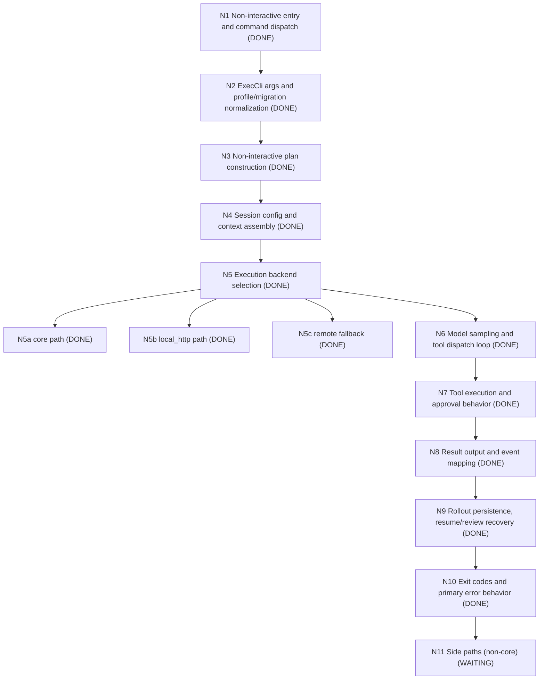

# exec Mainline Alignment DAG (PyCodex)

Last updated: 2026-06-03

```text
exec mainline
N1 Non-interactive entry and command dispatch [DONE]
  - File anchor: pycodex/cli/parser.py
N2 ExecCli args and profile/migration normalization [DONE]
  - File anchor: pycodex/cli/parser.py
N3 Non-interactive plan construction [DONE]
  - build_exec_config_bootstrap_plan
  - prepare_exec_run_plan
N4 Session config and context assembly [DONE]
  - _build_exec_session_config
N5 Execution backend selection (core/local_http/remote) [DONE]
  - N5a core path [DONE]
    - core_exec_enabled
    - run_core_exec_command
  - N5b local_http path [DONE]
    - local_http_exec_enabled
    - local-http run_exec_user_turn* chain
  - N5c remote fallback [DONE]
    - _resolve_exec_remote_endpoint
    - remote_exec_session_connect_and_run
    - remote hint distinguishes unix socket vs non-unix remote endpoint failures
    - explicit --remote failures for websocket and unix sockets no longer emit local startup guidance when connect fails
    - invalid remote address fails fast without local startup guidance
N6 Model sampling and tool dispatch loop [DONE]
N7 Tool execution and approval behavior [DONE]
  - shell tool approval/sandbox/output behaviors for common path
  - common forbidden and policy-denial edge cases are now covered
N8 Result output and event mapping [DONE]
N9 Rollout persistence, resume/review recovery [DONE]
N10 Exit codes and primary error behavior [DONE]
N11 Side paths (non-core) [WAITING]
  - MCP plugin behavior
  - Plugin marketplace install/runtime
  - app-server daemon semantics
  - execute only minimal compatibility stubs; do not expand unless exec-core requires it or user explicitly requests.
```

## Current node completion (authoritative)

- [x] N1 非交互入口与命令分发
- [x] N2 ExecCli 参数与 profile/migration 归一化
- [x] N3 非交互执行计划构建
- [x] N4 会话配置与上下文组装
- [x] N5 执行后端选择（core / local_http / remote）
- [x] N5a core 分支
- [x] N5b local_http 分支
- [x] N5c remote fallback
- [x] N6 模型采样与工具调度主链
- [x] N7 工具执行与审批行为（主链路径）
- [x] N8 结果输出与事件映射
- [x] N9 回滚持久化与 resume/review 恢复
- [x] N10 退出码与主错误行为
- [ ] N11 非核心边界（MCP/插件/marketplace/app-server）

## Mermaid node state snapshot (current)



## Next slice (this turn)

1. N1~N10 主线继续保持：不再新增功能，只做可复用兼容回退/阻塞修复（例如 Windows 沙箱回退 no-op 行为）。
2. N11 仍然 WAITING；仅在核心路径回归时再展开最小 shim。

### 2026-06-03 (Compatibility shim hygiene)

- 进度说明：主链未拆分新主逻辑节点。
- 兼容补齐：在 Windows 可执行链路上，`pycodex/core/windows_sandbox_read_grants.py` 增补 no-op 回退，避免 `exec` 在无沙箱原生后端时直接抛错。
- 继续在执行链中的阻塞点做小切片修复，避免边界扩展拖慢主干推进。

## Evidence anchors

- pycodex/cli/parser.py
- pycodex/exec/core_runtime.py
- pycodex/exec/local_runtime.py
- PORTING_STATUS.md
- tests/test_core_windows_sandbox_read_grants.py

### 2026-06-03 (Windows sandbox readiness completion parity)

- 主线阻塞修复（N1~N10 范围）：
  - `pycodex/core/windows_sandbox.py`：`sandbox_setup_is_complete` 恢复为“marker + users 文件版本匹配才算完成”。
  - `tests/test_core_windows_sandbox.py`：覆盖 marker/users 版本不匹配、JSON 解析失败、匹配成功场景，避免无条件返回 `False` 导致的错误状态。
- 本轮状态：未修改主线节点状态，只是将边界行为从“固定失败”修复为“可判定完成”。
- 证据文件：
  - `pycodex/core/windows_sandbox.py`
  - `tests/test_core_windows_sandbox.py`

### 2026-06-03 (Windows sandbox completion boundary hardening)

- 进一步补齐回归边界：确认 marker/users 版本字段不合法（浮点、布尔）与 `Path` 入参都不会产生误判 `True`。
- 证据：
  - `tests/test_core_windows_sandbox.py`
